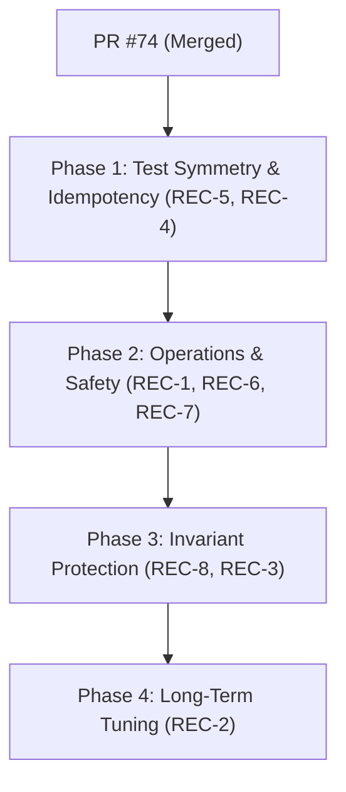

# M3b W12 Post-Closure Hardening Plan

**Статус:** Согласован (Архитектор + Оператор)  
**Дата:** 24 мая 2026 года  
**Контекст:** Успешное слияние PR #74 завершило функциональную реализацию W12 SentReplay и Hold-проекций. Этот план фиксирует 8 согласованных задач по стабилизации, верификации инвариантов и операционной гигиене шлюза перед переходом к следующим этапам (M3b Phase 6 pilot).

---

## 1. Сводный реестр задач стабилизации (Hardening Registry)

### REC-5: Восстановление симметрии тестов (Test Symmetry Gap)
* **Приоритет:** 1 (HIGH)
* **Класс:** Test-only
* **Проблема:** В интеграционных тестах присутствуют проверки `Hold(empty data_sign)` для сценария `SentReplay` (Δ5), но полностью отсутствуют аналогичные тесты для `SentFresh` и `Kvt1Reentry`.
* **Решение:** Написать 2 новых интеграционных теста в `tests/backlog_drain_state_dispatch.rs`:
  * `c6_sent_fresh_match_empty_data_sign_holds_drain` — проверяет переход в `Sent` с последующим `HoldFnDrain { HeldAtSent }` и эмиссией `KVT2_CONFIRM_HOLD`.
  * `c6_kvt1_reentry_match_empty_data_sign_holds_drain` — проверяет удержание в `Kvt1` с проекцией `HeldAtKvt1` и логом `KVT2_CONFIRM_HOLD`.
* **Объем изменений:** ~80 LOC в тестах.

### REC-1: Защита от бесконечного удержания (Hold TTL & 3-Tier Degradation)
* **Приоритет:** 2 (HIGH)
* **Класс:** Production + Test
* **Проблема:** Транзиентные сбои (`Hold`) не увеличивают счетчик попыток `attempts_used`. При перманентном локальном сбое (например, ошибка авторизации) ФН-дренаж заблокируется бесконечно из-за FIFO-остановки, не информируя оператора о необходимости вмешательства.
* **Решение:** Внедрить трехэтапную деградацию очереди:
  * **Tier 1 (10 подряд Holds на документе):** Эмиссия предупреждающего лога `KVT2_CONFIRM_PROLONGED_HOLD` в аудит (отображается на дашборде, статус не меняется).
  * **Tier 2 (50 подряд Holds или >12 часов):** Принудительный перевод ФН в режим `node_state.fs_mode = STOP_MODE`. Это останавливает прием новых чеков на эту ФН (защита от переполнения 36-часового лимита), но сохраняет существующие чеки в состоянии `Hold` для автоматической досылки.
  * **Tier 3 (Ручное вмешательство):** Ручной вызов эскалации через административный CLI.
* **Объем изменений:** ~120 LOC в `backlog_drain.rs` и `node_state`.

### REC-8: Верификация гонки W8 Return-Online vs Drain
* **Приоритет:** 3 (MEDIUM)
* **Класс:** Test-only
* **Проблема:** Возможна гонка состояний между фоновым опрашивающим процессом `W8 return_online_probe` (который переводит режим ноды `GoingOnline` → `Online` при обнаружении сети) и циклом дренажа (который читает `node_state.fs_mode` для фильтрации когорты).
* **Решение:** Написать интеграционный тест, симулирующий асинхронный CAS-переход режима ноды во время обработки `HoldFnDrain`, подтверждая стабильность и соблюдение инварианта взаимного исключения писателей (**W2**).
* **Объем изменений:** ~60 LOC в тестах.

### REC-3: Сбор мусора незавершенных трасс (Orphaned Traces GC)
* **Приоритет:** 4 (MEDIUM)
* **Класс:** Production + Test
* **Проблема:** Экстренный перезапуск шлюза (OOM, SIGKILL) во время выполнения сетевого DPS-вызова оставляет запись трассировки в `transport_trace` незавершенной (сиротской). При повторном тике SentReplay выделит новую запись, а старая навсегда останется в БД.
* **Решение:** Реализовать сборщик мусора незавершенных трасс в методе инициализации (`App::boot`):
  * Выборка трасс старше 60 секунд (буфер для in-flight запросов) с `outcome_kind = NULL`.
  * Закрытие их со статусом `outcome_kind = SystemCrash`, типом ошибки `ORPHANED_AT_BOOT_RECOVERY`.
  * Эмиссия системного аудита `TRANSPORT_TRACE_ORPHAN_CLOSED` (Info).
* **Объем изменений:** ~90 LOC в `app_boot` и `transport_trace`.

### REC-6: Гранулярность мониторинга удержаний (Granular FailureClass mapping)
* **Приоритет:** 5 (MEDIUM)
* **Класс:** Production / Documentation
* **Проблема:** Текущая кодовая база хардкодит `FailureClass::Transport` для всех Hold-причин в `DocVerdict::HoldFnDrain`, что скрывает специфику сбоев на дашбордах оператора.
* **Решение:** Выполнить маппинг ошибок в `confirm_drain_doc`:
  * `DpsTransport` → `FailureClass::Transport`
  * `DpsServer` / `DpsAuthorization` → `FailureClass::Internal`
  * `DpsDecode` → `FailureClass::Decode`
  * `LastChkDataSignEmpty` → `FailureClass::Internal` (структурный дрейф)
  * *Альтернатива:* Если жесткое приведение к `Transport` является осознанным упрощением для сохранения retry-бюджета, зафиксировать это решение в виде явной inline-документации.

### REC-2: Защита сетевых ресурсов (Per-FN Exponential Backoff)
* **Приоритет:** 6 (MEDIUM)
* **Класс:** Production + Test
* **Проблема:** При падении DPS массовые параллельные таймауты на сотнях ФН могут исчерпать пул файловых дескрипторов (sockets) шлюза. Глобальный Circuit Breaker вреден, так как заблокирует здоровые ФН.
* **Решение:** Изолированная экспоненциальная задержка на уровне планировщика дренажа для конкретной ФН:
  * Задержка следующего тика дренажа при Hold рассчитывается как `min(2^consecutive_holds * 30s, 30min)`.
  * Ресурсы сокетов настраиваются через ulimit и конфигурацию пула соединений `reqwest` во время инициализации шлюза.
* **Объем изменений:** ~70 LOC в `drain_orchestrator`.

### REC-4: Тест идемпотентности stage_finalize
* **Приоритет:** 7 (LOW)
* **Класс:** Test-only
* **Проблема:** Двухфазная фиксация W12 (`Kvt1→Kvt2` → `stage_finalize`) опирается на стабильность пути `AlreadyAcked` в `stage_finalize::run`. Любая регрессия в этом коде приведет к дублированию фискальных транзакций.
* **Решение:** Написать 1 простой интеграционный тест для валидации crash-recovery сценария:
  * Запуск `stage_finalize::run` для Kvt2 документа → переход в `Ack`.
  * Повторный запуск `stage_finalize::run` → подтверждение возврата `AlreadyAcked` без дублирования записей в БД.
* **Объем изменений:** ~45 LOC в тестах.

### REC-7: Документирование held-агрегации
* **Приоритет:** 8 (LOW)
* **Класс:** Documentation
* **Проблема:** Метод `record_doc_held_at_*` агрегирует счетчики, игнорируя детальные идентификаторы документов, что может быть неясно будущим разработчикам.
* **Решение:** Добавить короткий inline-комментарий, объясняющий, что детальный след по каждому документу пишется в `audit_log` (источник истины для аналитики), а `DrainSummary` намеренно оперирует агрегированными суммами для быстродействия.

---

## 2. Фазы выполнения и объемы изменений (Phasing)

Реализация разбивается на 4 независимых последовательных коммита для минимизации рисков регрессии.

### Phase 1: Test Symmetry & Idempotency
* **Цель:** Полное закрытие зазоров в тестовом покрытии.
* **Задачи:** REC-5 (empty data_sign тесты для SentFresh/Kvt1Reentry), REC-4 (тест идемпотентности).
* **Суммарный объем:** ~130 LOC (только тесты).

### Phase 2: Operations & Safety
* **Цель:** Предотвращение блокировок касс в Pilot-эксплуатации.
* **Задачи:** REC-1 (3-tier STOP_MODE при длительном Hold), REC-6 (маппинг FailureClass), REC-7 (inline-документация агрегации).
* **Суммарный объем:** ~150 LOC в коде ядра.

### Phase 3: Invariant Protection & Durability
* **Цель:** Защита от гонок и системных сбоев (OOM/SIGKILL).
* **Задачи:** REC-8 (тест гонки W8 Return-Online vs Drain), REC-3 (сборщик мусора orphaned трасс).
* **Суммарный объем:** ~150 LOC (код ядра + тесты).

### Phase 4: Long-Term Tuning
* **Цель:** Оптимизация сетевой подсистемы при масштабных сбоях.
* **Задачи:** REC-2 (Per-FN backoff на уровне планировщика).
* **Суммарный объем:** ~70 LOC в планировщике.
