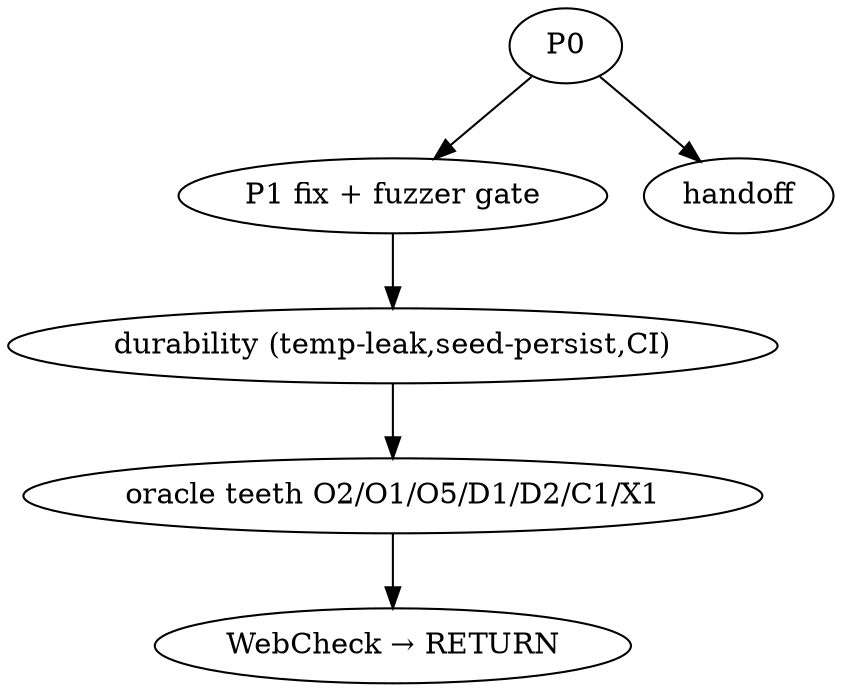

# Optimal Roadmap — correctness & fuzzer spine (2026-06-17, architect)

**Author:** architect session (locks contracts / reviews / merges). Implementer writes code, strict RED-first TDD.
**Scope:** all currently-open correctness/fuzzer threads, sequenced by dependency + ROI + risk. Pilot-track backlog positioned but not on the critical path.

> **⚠ STATUS UPDATE (2026-06-17, post-merge):** **Phase 1 below (the P1 fix tranche) is DONE — P1 is FIXED + MERGED** (PR #196, merge `b858d75`; fix `c927d47`, teeth `440f335`). The shipped fix targets **2 arms** (the `OfflineAckOutcome::Refused` arms, on `CodePoolExhausted`), **not** "all four arms" — the two `PostSignRoute::Refused(_)` dispatcher arms are **deferred by design**. The current frontier is **Phase 2** (fuzzer durability, PR #197). Read the Phase-1 section and the "Fix P1 first" thesis below as a **historical record**, not a live to-do.

> **⚠ STATUS UPDATE (2026-06-17, later — supersedes the frontier above):** Phase 2 (fuzzer durability) is now **MERGED** (#200/#201/#202) and the fuzzer is an **ENFORCED merge gate** (`x86_64-unknown-linux-gnu` required + `rust-prro-skip.yml` companion). **The Phase-3 section below is superseded by the authoritative spec `docs/superpowers/specs/2026-06-17-fuzzer-phase3-oracle-honesty-design.md` (PR #204)**, which redefines the D/C boundary after an external audit: **D1–D5 → WebCheck** (NOT Phase 3 — only O2's *narrow* deterministic crash-prediction slice is carved in); **O3 retargeted** to DB-integrity (canonical-truth → WebCheck); **C1 PROMOTED** to a minimal Phase-3 unit (a legal-cap blind spot an enforced gate must not silently certify); **O1 split** (scripted-convergence only, `ERROR_RETRYABLE` out, paired negative teeth). Read the Phase-3 bullets below as the *initial sketch* — the spec is authoritative.

---

## Thesis

P1 is a **proven production bug** (boot-resume refusal asymmetry → a refused receipt can later be resurrected and issued). Correctness is priority #1 (CLAUDE.md). So the optimal order is **not** the pre-P1 polish roadmap — it is:

> **Fix P1 first (with its fuzzer gate) → make the fuzzer a durable CI gate → close the highest-leverage oracle false-negatives → then the big bets (WebCheck, RETURN).**

External-audit handoff and the CLAUDE.md pin fix are cheap, independent, and run in parallel.

---

## Sequencing rationale (why this order)

- **P1 before polish.** A proven legal/financial-risk bug outranks tool polish. The fix is low-risk: it mirrors the already-locked #192 design (`Aborted` terminal + `terminalise_inbox`), now applied to the boot path.
- **P1 bundles its own fuzzer gate.** The blind spot that hid P1 (`Crash(Sign)` + a mode-forcing op) is exactly what makes `StuckNonTerminalDoc` bite the regression. Fix + gate = one tranche, or the bug can silently come back.
- **Durability foundation before more oracle work.** Seed-corpus persistence (X3) is the *compound* mechanism — without it every future find has no permanent guard except a hand-written teeth test. Land it before Cluster C so new finds auto-pin. temp-DB-leak fix removes the CI-flake that currently blocks trusting large-N runs.
- **Oracle teeth after durability.** Closing O/D/C false-negatives is high value, but the fuzzer is already CI-grade (§15); these are incremental. Do them once finds are durably pinned. Order within: O2 first (recovery-under-fault is the dominant historical bug class and the oracle is weakest there).
- **Big bets last.** WebCheck (Phase-1 oracle) solves model-drift — deepest risk, but large; it pays off only once the harness it feeds is trusted. RETURN (Phase-2) is coverage expansion on a solid tool.

---

## Critical path

### Phase 0 — opportunistic, now, architect-only (minutes, no implementer)
| # | Item | Why now | Gate |
|---|------|---------|------|
| 0.1 | **CLAUDE.md M3b pin wording** (finding #2): post-send DPS reject *keeps* a `Rejected` ledger row; pin = "no NON-terminal doc at quiescent", not "no rejects in ledger". | 2-min doc fix; the imprecise paraphrase actively misleads (it contradicts `error_routing.rs:295` / `model.rs:242`). | doc-only |
| 0.2 | **External-audit handoff**: push `docs/fuzzer-external-audit-brief`, open PR (brief + dry-run + P1 repro). | Independent; the package is ready and self-contained. **External publish → needs operator OK.** | operator confirm |

### Phase 1 — P1 fix tranche (correctness #1; my contract → implementer → my review+merge)
**Effort:** small–medium (inferred). **Hot zone:** `boot_phase` (plan-first).
- **My deliverable (contract/spec, RED-first):**
  - Terminal-refusal subset (`CodePoolExhausted` + any non-clearing reason) → `Aborted` in the same `with_immediate` envelope, reusing the live `terminalise_inbox` abort.
  - Applied **symmetrically to all four boot arms**: SIGNED-resume `boot_phase.rs:3745`/`3750` **and** PREPARED-resume `dispatch_prepared_via_chain` `3514`/`3522`.
  - Transient-mode refusal (`Blocked`/`StopMode`/`CryptoDegraded`/`GoingOnline`) stays **deferred** (current behaviour, correct).
  - RED pin asserts `after == Aborted` (the verified `#[ignore]`d repro, inverted from bug-present to fix-target).
  - **Fuzzer gate in the same tranche:** add `Crash(Sign)` stage + a mode-forcing op so `Crash(Sign) → boot-in-refusing-mode` is expressible; `StuckNonTerminalDoc` then bites it as a regression gate. Add the shrunk repro to the teeth corpus.
- **Risks to pin in the contract:** atomicity (inbox-terminalise + doc→Aborted in one envelope); MAC-walk fence (a refused SIGNED doc in the chain walk must not false-flag `ChainBreak`); consumer-completeness for the new boot-path edges (reuse the #192 `Aborted` consumer set — already enumerated).
- **Gate:** targeted boot-recon tests + the new RED pin GREEN + full fuzzer suite + 4-target matrix.

### Phase 2 — fuzzer durability foundation (Tier-1; my contract → implementer)
**Effort:** medium. Makes the tool a trustable CI gate + every find permanent.
- **2.1 temp-DB-leak fix** — `std::mem::forget` in `interp.rs` (T2) → shared/cleaned tempdir; removes the `/dev/shm` exhaustion + CI link-time flake on large-N.
- **2.2 Seed-corpus persistence (X3)** — enable proptest file-based `failure_persistence` committed to the repo; convert each historical find (AUD-K8-1, #192, P1) into a directed `#[test]` + pinned seed. *This is the compound ROI lever.*
- **2.3 CI integration** — PR-time small N (fast gate) + nightly large-N (depth) + auto-persist shrunk failures into the corpus.
- **Gate:** nightly large-N green on disk-TMPDIR; a deliberately reverted guard re-found from the persisted corpus (teeth pattern).

### Phase 3 — oracle teeth (Cluster C high-leverage subset; my contract → implementer)
**Effort:** medium, incremental. Closes "fuzzer passes while a real bug exists."
- **O2** (highest leverage) — give `Crash`/`Reboot` faults a bounded-postcond + differential (route a completed crash-Doc through the predictable-mutating differential). Recovery-under-fault is the dominant bug class; the oracle is currently blind there.
- **O1** — drive `online_convergence::run_tick_for_fn` at settle, symmetric with the offline drain-tick, so a stuck online doc (`SENT`/`KVT1`/`ERROR_RETRYABLE`) becomes a liveness failure instead of being blessed.
- **O5** — filtered `ArtifactNoResend` scan (filter the one excused transient doc by id, assert the rest clean) instead of skipping the whole scan.
- **D1/D2** — derive+assert `next_lnd` and mode/shift transitions instead of adopting them from the DB (kills two vacuity points).
- **C1** (legal) — `OfflineCapExceeded` variant + a fixture seeding a real `max_offline_codes`; the offline cap is a hard legal limit, presently unmodeled.
- **X1** — wire a cheap `StuckNonTerminalDoc` + `StuckSending` subset into `run_boot_reconciliation`'s tail (mode-gated) so the #192/P1 class is a *runtime* guard, not only a test oracle.
- **Gate:** each closure ships with a teeth canary (revert → fuzzer finds).

### Phase 4 — big bets (later, after the tool is trusted)
- **4.1 Phase-1 WebCheck oracle (Tier-2, wildcard-collapsing)** — decompiled WebCheck + live DBs as ground-truth reference, replacing the hand-written model that has already drifted (6 reconciliations during T7). Differential "our output vs WebCheck"; live DBs as a *real* seed corpus. Highest honesty value, largest effort.
- **4.2 Phase-2 RETURN alphabet (Tier-3 coverage)** — operator: RETURN first ("все инварианты по нему за пару часов"), then Z / SHIFT_OPEN-online / EVPZ / clock (offline-cap 36h, cert-expiry).

---

## Parallel / independent tracks
- **External handoff** (0.2) — anytime, doesn't block code.
- **Live-DPS test campaign** (WebCheck replay+diff+soak) — separate validation axis; the fuzzer proves *our* machine, not interop. Feeds 4.1.

## Standing backlog (positioned, NOT on the critical path)
Correctness/recovery: AUD-K8-2 (per-doc chain-integrity guard, defense-in-depth over the coarse shift-gate); DPS status -3 ERROR_SAVE → retryable (currently terminal REJECTED). Receipt-fuzz (XSD/decode input fuzz — orthogonal to this state-machine fuzzer).
Pilot-track (per CLAUDE.md priority order, after correctness confidence): visual PRRO config + licensing; remote monitoring (must-have pre-pilot, off by default); receipt printing (Windows); DB-config hot-reload; FN auto-discovery; national-cashback ERECEIPT block; TSP/RFC-3161; JKS-password → KMS.

---

## Recommended immediate action
Phase 0 now (0.1 doc fix immediately; 0.2 on your OK), then **lock the Phase-1 P1 fix contract** and hand to the implementer. Phases 2→3→4 follow; 4.1 WebCheck is the inflection point where polish turns into self-validating ground truth.

