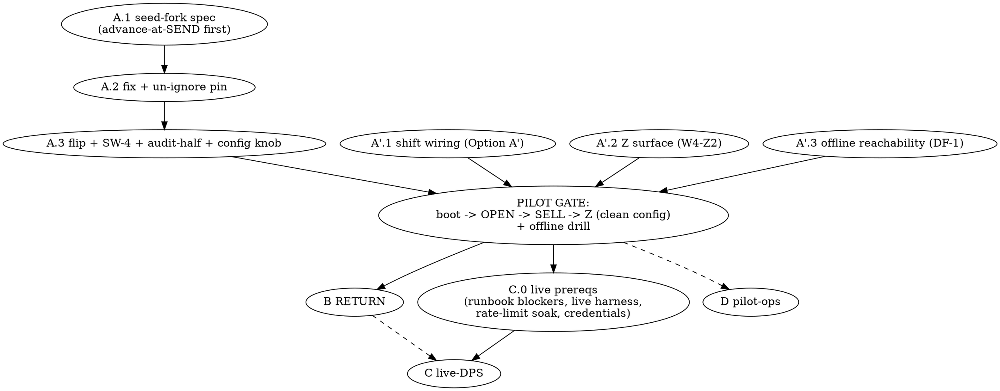

# Pilot-Path Roadmap — from a verified core to a trading pilot (2026-07-04, architect)

**Author:** architect session (locks contracts / reviews / merges); implementer writes code, strict RED-first TDD.
**Status:** **LOCKED v2 (2026-07-04)** — v1 draft → wide external audit (3 HIGH / 3 MED / 6 LOW; H1 architect-verified by hand) → v2 closes all findings. The audit's decisive catch: **v1 shipped an activated online lane into a gateway whose shift gate is welded shut** — the pilot could not have fiscalized a single SELL.
**Predecessor:** `2026-06-17-optimal-roadmap.md` — **COMPLETE** (fuzzer spine: durability → enforced gate → oracle honesty → WebCheck ground-truth U0–U3, all merged incl. #218).

---

## Thesis

The core is verified three ways — mechanically against our own normative pins (U1 adoption-lint), generatively against random operation sequences (enforced fuzzer gate + nightly), and structurally against field shapes (**U3: zero *unexplained* divergences on the sanitized SELL-lane corpus; 9 intentional deltas documented** — audit-H2 wording). What the pilot lacks is the **live fiscal day**: the online write-path is DORMANT, **and the shift lifecycle around it is unwired** — production boot seeds `ShiftState::Closed` (`boot_phase.rs:1835`), every sell on Closed is refused (`stage_acquire.rs:901-905`), no production path opens a shift (zero `insert_created` prod callers), inline rejects SHIFT_OPEN (`SHIFT_OPEN_NOT_SUPPORTED`) and Z (`FULL_Z_SURFACE_READY = false`, `z_builder.rs:48`), and the offline fallback is unreachable (DF-1: no prod mode setter / session opener). **A legal trading day = boot → SHIFT_OPEN → SELLs → Z-close; the pilot gate is that whole chain on a clean production config — not "ingress→ACK".**

> **Activate the online path (A) AND wire the fiscal day around it (A′ — the operator-locked Option A′ plan) → widen the alphabet (RETURN) → prove live interop (DPS campaign) → wrap the ops shell (pilot track).**

## Sequencing rationale

- **A and A′ are peers on the critical path** (audit H1). The fuzzer investment justified A2.4 as the riskiest src change; the audit proved A alone is non-trading. A′ implements the **operator-locked Option A′** (`docs/superpowers/plans/2026-05-29-online-shift-lifecycle-wiring.md`, decided 2026-05-30: wire online + offline shift lifecycle) — which v1 failed to even reference.
- **RETURN after the fiscal day exists** — it then tests a live path, and unfreezes C2 / cancel-fixture / C1-time.
- **Live-DPS needs a live day, NEW tooling, and its runbook blockers retired** (audit H3) — not just "reuse the corpus".
- **Ops shell overlappable** once A/A′ derisk the core.

---

## Critical path

### Phase A — A2.4: online write-path activation (SRC, hot-zone)

**State (verified):** binding `UnimplementedWritePath` at `runtime/supervisor.rs:188` (barrier comment :180-187); prerequisite RED pin `m1_02_online_seed_fork_a24_prerequisite` `#[ignore]`d at `kill_point_matrix.rs:2542` — the **only** A2.4-gated ignored pin.

**The blocker (AUD-L2-1a seed-fork):** the online seed advances only at `stage_finalize` (ACK); two SELLs resting at SENT fork the chain.

**Units:**
- **A.1 — seed-fork design spec** (implementer drafts → architect adjudicates → external audit → lock). **Options — the incumbent goes first (audit M1):** *option zero* = **advance-at-SEND** inside the `Sending→Sent` `with_immediate` envelope + generalize the finalize gate (the Batch-C incumbent: `REMEDIATION-PLAN-2026-06-13.md` §Batch C; mirrored at `kill_point_matrix.rs:2533`) · advance-at-SIGN · serialize-SENT-per-FN · seed-fence-at-sign. **Constraints (extended per audit):** Frozen #1/#2 · the inline `Sent→lastChk→ACK` ladder · P1 boot-resume · drain/offline-lane interplay (M2-01 per-doc advance + drift assert, `stage_offline_ack.rs:361-368`) · **the Rejected-after-SENT persistence pin** ("lnd consumed, seed NOT advanced" — any advance-before-ACK option changes that pin; CLAUDE.md M3b) · the W10.4 MAC-recovery family. **A.1 is a re-adjudication of Batch C, not a blank slate.**
- **A.2 — seed-fork fix** per locked spec; un-`#[ignore]` `m1_02`; **re-triage the O1-stacked-SENT deferral** (that artifact becomes REAL once online activates).
- **A.3 — binding flip + companions (audit M2):** the flip is a hard-coded DI swap — the **config knob + rollback policy is NEW surface**, spec it in A.1; **SW-4** (inline `ChainSeedMismatch` → manual-recon escalation parity; flagged "A2.4-only" in the REMEDIATION-PLAN) lands with the flip; the RS3 definition of A2.4 includes the **inbox-terminalise audit** half — in scope; A.1's dossier must state **A2.2/A2.3/A2.5 status** (≥1 deferral still points at A2.2: NC-02).
- **Gate:** full suite + capstones + WebCheck replay green; targeted boot/recovery regression. (The e2e smoke moves to the **A+A′ combined** gate — it needs a shift.)

### Phase A′ — the fiscal day: shift lifecycle + Z surface + offline reachability (SRC; peer of A — audit H1)

Implements the **operator-locked Option A′ plan** (2026-05-29 wiring doc) and retires the overlapping runbook §4.9 blockers:
- **A′.1 — online SHIFT_OPEN / SHIFT_CLOSE wiring** through the write-path (removes `SHIFT_OPEN_NOT_SUPPORTED`; un-welds the shift-edge whitelist — today only the 4 drain-side edges of 15 can ever fire).
- **A′.2 — Z surface completion (W4-Z2):** the `FULL_Z_SURFACE_READY` → true path (TXS/IO/EPZ builder halves) — unblocks the legal daily close.
- **A′.3 — offline reachability (DF-1):** prod mode setter (GO_OFFLINE/GO_ONLINE seam) + a prod caller for `OfflineSessionService::open_session` — the INV-08 legal fallback must be reachable; Phase-D's operator buttons consume this same seam.
- **PILOT GATE (redefined per audit H1):** **boot → SHIFT_OPEN → SELLs → Z-close on a clean production config** (no test-seeded state) **+ the offline drill** (GO_OFFLINE → offline sells → drain). This combined A+A′ e2e is the phase exit.
- Internal sequencing: A′.1 proceeds in parallel with A.1/A.2 (different seams).

### Phase B — RETURN alphabet (tests-heavy + write-path arcs)

- **B.1** RETURN through the write-path (`CanonicalDoc::Return` exists; note: `golden/` has `checkbox_rest_return` — **no `webcheck_return`** golden, audit L2; corpus RETURN shapes come from B.3).
- **B.2** Fuzzer alphabet `Return` + model arcs; unfreezes **C2** (`OfflineLocalAck→Cancelled` auto-invoker), **extends the cancel_edge fixture to full** (it is already `replay:true` partial — audit L1), and the **C1-time slice** (168h `-11 ERROR_OFFLINE_168`).
- **B.3** Corpus RETURN shapes from the dumps (tooling ready; standing CP1 discipline).
- Later in-tier: EVPZ / clock. (Z moved to A′ — it is pilot-critical, not coverage.)

### Phase C — live-DPS campaign (replay + diff + soak)

- **C.0 — prerequisites (audit H3; NEW unit):** retire the `docs/operations/LIVE_DPS_SMOKE_RUNBOOK.md` §4.9 NO-GO blockers (DF-5 fiscal-mode fail-fast; WL-1/DF-1 land via A′); **build the live-transport replay harness** — the U3 harness is corpus+ScriptedDps only, live-endpoint injection is NEW tooling; **rate-limit-aware soak design** (documented DPS `-4` rate-limit with 5+ min per-FN cooldown — a naive soak contradicts DPS behavior); credentials checklist (JKS path/pass, TN match, FN registration, fiscal-mode). Prior live evidence counts and is cited: a full SHIFT_OPEN→SELL→Z cycle was accepted by **real DPS on 2026-05-29** (manual ignored smokes, `live_dps_extended_smoke.rs`); the attached-CMS signer is on main.
- **C.1** test-cabinet first (`cabinet.tax.gov.ua:9443`; `_TS` semantics per U0 §6) → then production DPS.
- **C.2** replay the corpus + shift-framed real-shaped days (possible only post-A′); diff observables; soak within the rate-limit budget; error-class census.
- **C.3** latency measurement (real RTT + DPS processing) — replaces the inferred 2-RTT budget; validates the drop-second-lastChk optimization candidate.
- **Deliverable:** an interop dossier.

### Phase D — pilot operational track (overlappable with B/C)

1. **Remote monitoring** (must-have pre-pilot, off by default).
2. **Operator controls (audit M3):** GO_OFFLINE/GO_ONLINE buttons + reconciliation trigger — "must-have для пілоту" per the UI backlog; consumes the A′.3 seam.
3. **Receipt printing** (Windows spooler for the pilot per the backlog; note the in-repo `prro_escpos` crate — reconcile the two approaches, audit L6).
4. **Visual PRRO config UI** (pre-pilot). **Licensing — RULED (audit M3): post-pilot**, per the dedicated licensing memo («після стабільного пілоту»); the UI memo's «до пілоту» refers to the config UI, not licensing enforcement.
5. **Ingress decision (audit M3 — operator input at pilot-planning):** only REST is bound at boot (`supervisor.rs:189`); XML-RPC/Maria are enum stubs; the WebCheck-shim is a read-only status route today. **If the pilot migrates WebCheck/1C points, the shim jumps to pilot-critical** — decide when the pilot cohort is chosen.
6. Post-pilot: DB-config hot-reload, FN auto-discovery, cashback ERECEIPT, TSP, JKS→KMS.

---

## Standing guards (do not regress)

- Enforced gnu gate + nightly (FUZZ_CASES=4096) + committed seed corpus; WebCheck replay + corpus leak-gate in the required suite; corpus changes under the CP1 discipline; the X1 prod runtime guard stays green through A/A′.
- Deferred-but-tracked: `Crash(Finalize)` src seam; O5 by-id; `max_offline_codes` comment; AUD-K8-2; receipt-fuzz. (**ERROR_SAVE→retryable removed — already done on main**: `error_routing.rs:424-425` routes `-3` as transient per W0-3; audit L3 — the memory backlog note is stale.)

## Recommended immediate action

**A.1 (seed-fork spec, incumbent-first) and A′.1 (shift wiring, per the already-locked Option A′ plan) start in parallel** — different seams, both architect-contract → implementer. The A.1-prep contract already issued is **extended** with the M1 additions (option zero advance-at-SEND; the Rejected-after-SENT pin; A2.2/A2.3/A2.5 status; SW-4/audit-half companions).

