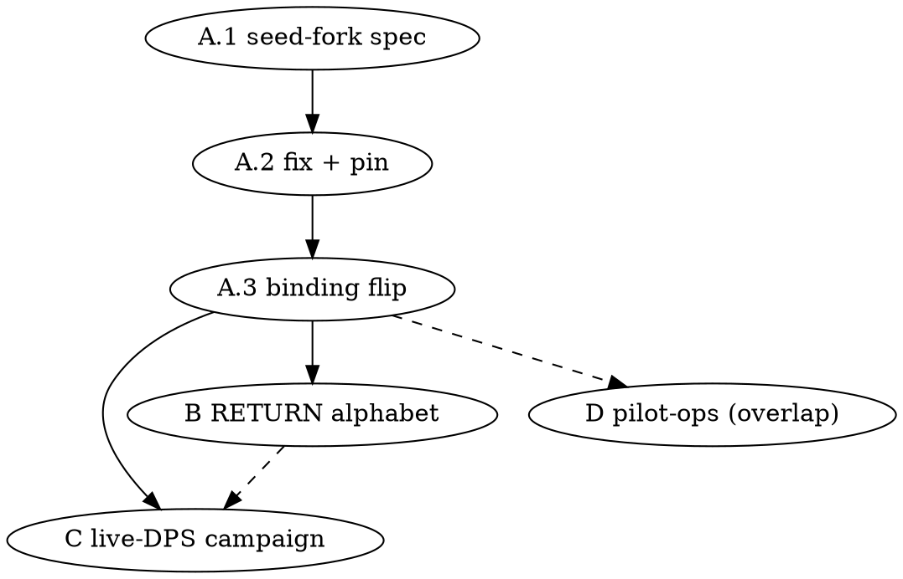

# Pilot-Path Roadmap — from a verified core to a trading pilot (2026-07-04, architect)

**Author:** architect session (locks contracts / reviews / merges); implementer writes code, strict RED-first TDD.
**Status:** DRAFT — for external adversarial audit, then lock (the proven spec cycle).
**Predecessor:** `2026-06-17-optimal-roadmap.md` — **COMPLETE** (fuzzer spine: durability → enforced gate → oracle honesty → WebCheck ground-truth U0–U3). This roadmap shifts the frontier from *verifying the machine* to *putting the machine into a merchant's hands*.

---

## Thesis

The core is now verified three ways: mechanically against our own normative pins (U1 adoption-lint), generatively against random operation sequences (enforced fuzzer gate + nightly), and structurally against four years of field reality (U3 clean replay, zero real divergences). What the pilot lacks is not more verification of what exists — it is **the online write-path itself** (still DORMANT) and the **operational shell** around the core.

> **Activate the online path first (A2.4, under the safety net built for exactly this) → widen the fiscal alphabet (RETURN) → prove live interop (DPS campaign) → wrap the operational shell (pilot track).**

## Sequencing rationale

- **A2.4 before everything.** Every phase of the fuzzer investment was justified as "the safety net for the riskiest remaining src change" — that change is A2.4. Doing lower-risk work first while the pilot's core feature stays dormant inverts the ROI logic.
- **RETURN after A2.4, not before.** RETURN is tests-heavy but touches the same write-path; landing it on an *activated* path tests reality, not a dormant seam. It also unfreezes two corpus fixtures (cancel_edge, z_report → later Z work) and the C2 corruption class.
- **Live-DPS campaign needs a live online path.** Replay+diff+soak against the real tax authority is meaningless while `inline::run` is unbound. It reuses the WebCheck corpus/tooling (built).
- **Pilot track (ops shell) last but overlappable.** Monitoring/printing/config are independent of write-path work — schedule opportunistically once A2.4 derisks the core.

---

## Critical path

### Phase A — A2.4: online write-path activation (SRC, hot-zone; the flagship)

**State (verified 2026-07-04):** binding is `UnimplementedWritePath` at `runtime/supervisor.rs:188` with an explicit barrier comment (:181); the prerequisite RED pin `m1_02_online_seed_fork_a24_prerequisite` is `#[ignore]`d at `kill_point_matrix.rs:2542` — "do NOT activate InlineWritePath until resolved".

**The blocker (AUD-L2-1a, online seed-fork):** the MAC-chain seed advances only at `stage_finalize` (ACK). Two online SELLs resting at `SENT` fork the chain — doc2 signs against the stale pre-doc1 seed. Any activation without resolving this ships a chain-integrity bug.

**Units (each its own contract → RED-first → review):**
- **A.1 — seed-fork design spec.** Options to adjudicate (draft → audit → lock): advance-at-SIGN vs serialize-SENT-per-FN (single in-flight online doc) vs seed-fence at sign-time. Constraints: Frozen #1 (no wire in tx), #2 (single-writer), the inline `Sent → lastChk → ACK` confirm ladder, boot-resume semantics (P1 fix), drain interplay. **This spec decides the hardest open design question in the repo — full cycle: draft → external audit → lock.**
- **A.2 — seed-fork fix** per locked spec; un-`#[ignore]` `m1_02` as its RED pin; fuzzer alphabet: consider `OnlineSell` bursts resting at SENT (the O1-stacked-SENT artifact becomes REAL once online activates — re-triage that deferral).
- **A.3 — binding flip** (`UnimplementedWritePath` → `InlineWritePath` at the supervisor site), behind config if staged rollout is wanted; end-to-end ingress→ACK smoke; latency histogram (the "сколько до выдачи" measurement — currently inferred-only, 2×RTT ladder).
- **Gate:** full suite + capstones + WebCheck replay green (the net this was built for); new e2e online smoke; targeted boot/recovery regression.

### Phase B — RETURN alphabet (tests-heavy + write-path arcs)

- **B.1** RETURN through the write-path (canonical builder has `CanonicalDoc::Return`; golden `webcheck_*` fixtures exist) — operator estimate: "все инварианты по нему за пару часов" (optimism to be tested).
- **B.2** Fuzzer alphabet: `Return` op + model arcs; unfreezes **C2** (`OfflineLocalAck → Cancelled` corruption class — gets its auto-invoker), the **cancel_edge** fixture (replay:false → full), **time-limit C1** slice (168h `ERROR_OFFLINE_168` DPS-reject fits this tranche).
- **B.3** Corpus: export RETURN shapes from the dumps (tooling ready; one sanitizer run under the standing CP1 discipline).
- Later in-tier: Z / SHIFT_OPEN-online / EVPZ / clock — each unfreezes its corpus fixture (z_report) and follows the same pattern.

### Phase C — live-DPS campaign (WebCheck replay + diff + soak; separate axis)

- **C.1** Test-cabinet first (`cabinet.tax.gov.ua:9443` — the `_TS` mirror semantics from U0 §6 now pay off), then production DPS.
- **C.2** Replay the corpus + real-shaped traffic against live DPS; diff against expected observables; soak for stability (long-run, error-class census: which DPS errors actually occur, rates, retryability — feeds the ERROR_SAVE backlog item).
- **C.3** Latency measurement (real RTT + DPS processing) — replaces the inferred budget; validates the 2-RTT ladder cost and the "remove the second lastChk round-trip" optimization candidate.
- **Deliverable:** an interop dossier (what DPS actually does vs our model of it) — the last honesty gap the offline work cannot close.

### Phase D — pilot operational track (per CLAUDE.md priority, overlappable with B/C)

Ordered per the standing backlog (correctness confidence now earned):
1. **Remote monitoring** (must-have pre-pilot, off by default).
2. **Receipt printing** (Windows-only for pilot).
3. **Visual PRRO config + licensing** (pre-pilot UI).
4. WebCheck-shim ingress **status review** (the 1C drop-in migration path — spec exists, wiring partial; decide: pilot-critical or post-pilot).
5. Post-pilot: DB-config hot-reload, FN auto-discovery, national-cashback ERECEIPT, TSP/RFC-3161, JKS→KMS.

---

## Standing guards (do not regress)

- The enforced gnu gate + nightly (FUZZ_CASES=4096) + committed seed corpus stay the merge spine; every phase above passes through them.
- WebCheck replay + corpus leak-gate are required-suite members; corpus changes go through the CP1 discipline (sanitizer + scanner + architect sample review).
- The X1 prod runtime guard (ledger pin) now watches recovery in production — Phase A must keep it green.
- Deferred-but-tracked: `Crash(Finalize)` src kill-point seam; O5 by-id tighten; `max_offline_codes` vestigial-comment; AUD-K8-2; ERROR_SAVE→retryable (feeds from C.2); receipt-fuzz (orthogonal).

## Recommended immediate action

**A.1 — the seed-fork design spec.** It is the hardest open design question, it gates everything pilot-shaped, and the full spec cycle (draft → external audit → lock) takes calendar time that should start now. B/D items can interleave once A.1 is locked and A.2 is in implementation.

